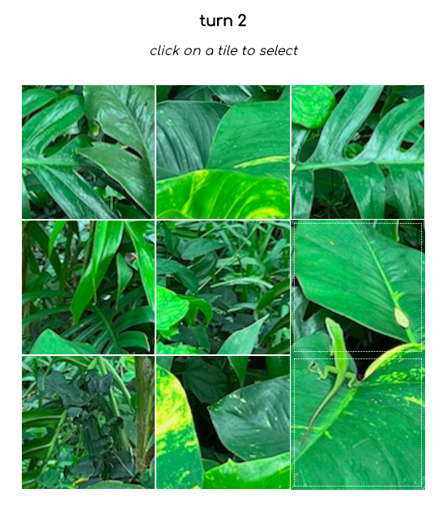

# The Wandering Eye

#### By E. Luckie ☀️

#### This application will act as an interactive photo portfolio - with a twist. Users are able to view a digital zine, play two different strategy games with select photos from the collection, and browse additional photos.

<!-- ### Table of Contents

_{add clickable or dropdown}_ -->

## Technologies Used

* React
* Redux
* JSX
* HTML
* CSS
* JavaScript
* Markdown
* Webpack
* npm
* Framer Motion
* Canva
* Git
* Firebase

## Setup/Installation Requirements

1. Clone this repository to your desktop
2. Navigate to the top level of this directory called ``the-wandering-eye``
3. Run the code ``npm install`` in your terminal to install the necessary packages and plug-ins
4. Run the code ``npm run start`` in your terminal to start the application and open the project in your web browser

## Description

This webpage acts as an interactive photo portfolio for my personal landscape photographs. From the navbar on each page, users are able to navigate to the ``home``, ``zine``, ``play``, or ``about`` pages. On the home page, if you click on the site's logo, it will also take you to the ``browse`` page - a current work-in-progress.

[Click here](https://the-wandering-eye.web.app/) to view the live version of this webpage.

#### Zine
>* has clickable options to view the video or pages version of the digital zine
>* clicking **video** loads & automatically starts playing the video version of the digital zine
>* clicking **pages** loads the zine in flipbook format. click on the right of the photo to flip to the next page, the left to flip to the previous
>* _NOTE: default is showing 2 pages at a time but if the window is resized smaller than the size of the doubled zine pages, it will display one page at a time_ 

#### Play
>* displays options between slider & puzzle game
>* on first visit, after selecting which game, only a clickable color palette will display. choose a color to begin a game
>* the game will randomize difficulty between 3x3, 4x4, 5x5, or 6x6
>* to start a new game, click on a new color on the color palette. to choose a different randomized difficulty, click on the same color again. to play the other game, click the **play puzzle** or **play slider** at the top of the page (will display the opposite of whichever game you're already playing)
>* _PUZZLE GAME:_ user clicks on two tiles to switch their positions until all tiles are in the proper spot & the game is finished
>* _SLIDER GAME:_ user clicks on one of the tiles touching the blank tile to switch positions. to win, all tiles should be in their correct position & the blank tile should be in the bottom row at the last spot on the right
>* on game finish, the entire full photo is revealed as well as the amount of turns it took to complete
>* **high scores board coming soon**

#### About
>* learn more information about me and my photos
>* clicking **me** displays a small blurb about me including links to my virtual resume as well as my github profile
>* clicking **photos** displays a small blurb about my photos including my instagram handle to see more
>* _if you hover over my selfie, it turns me into a radiating eyeball._ move your cursor after to see the reverse effect

#### Browse
>* **coming soon**

<!-- ## Gameplay

#### select game

#### game start

#### select a tile

#### select a second tile to swap
_when in the correct position, tile has inner border_\

#### on game win
 -->

## Zine View

#### video

#### pages

<!-- ## About
#### the wandering eye feature

https://github.com/eluckie/the-wandering-eye/assets/121265815/8a52db70-36e0-45a5-93d0-462a81ad553f -->

<!-- ## Diagrams

#### Site Diagram

#### Component Diagram

#### Landing Pages
 -->

## Known Bugs

* Does not show direction to "choose new color" after adding high score
* If user navigates away from gameplay when prompted for score (before/after adding) & then navigates back to page, user is prompted to enter name again
* Text on instructions overflow from modal on mobile
<!-- try making into components & see if that fixes render issue -->

## Stretch Plans
* add input validation/error handling for high scores
* create webapi to browse photos (NoSQL)
* user upload to create custom sliding puzzles on demand?
<!-- 
* EASTER EGG - hidden onClick that does annoying little window.alert popup
* update screenshots in README
* custom domain
-->

## License

MIT License

Copyright (c) 2023 Luckie

__________

This project was bootstrapped with [Create React App](https://github.com/facebook/create-react-app).
