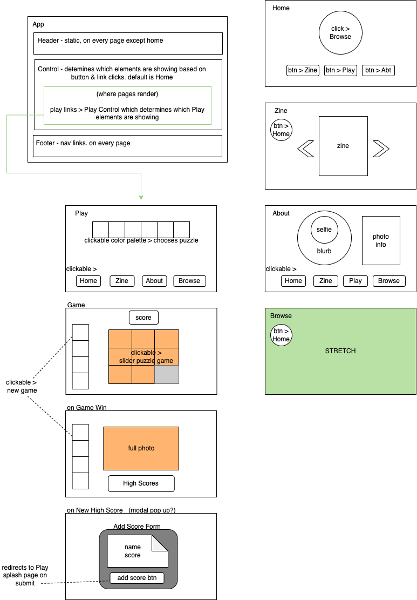

# Capstone

#### By E. Luckie ☀️

#### This application will act as an interactive photo portfolio - with a twist. Users are able to view a digital zine, play a sliding puzzle game with select photos from the collection, and browse additional photos.

### Table of Contents

_{add clickable or dropdown}_

## Technologies Used

* React - ui
* JSX - ui
* NoSQL - backend
* HTML
* CSS
* JavaScript
* Webpack
* npm
* Markdown
* Canva
* Firebase
* Git

## Setup/Installation Requirements

_{Leave nothing to chance! You want it to be easy for potential users, employers and collaborators to run your app. Do I need to run a server? How should I set up my databases? Is there other code this application depends on? We recommend deleting the project from your desktop, re-cloning the project from GitHub, and writing down all the steps necessary to get the project working again.}_

## Description

_{This is a detailed description of your application. Give as much detail as needed to explain what the application does as well as any other information you want users or other developers to have.}_

<!-- [Click here](https://eluckie.github.io/_______/) to view the live version of this webpage. -->

## Diagrams

#### Site Diagram

#### Component Diagram

#### Landing Pages

## Known Bugs

* _Any known issues_
* _should go here_

## Stretch Plans

<!--
* Firebase - NoSQL (high scores) & hosting
* DIGITAL ZINE - canva, sort by month (video format)
* choosing puzzle from color palette - (2 games/3 each, randomize difficulty onClick)
* SLIDING PUZZLE GAME - with high scores board. high scores viewable from each game home page? (using button)
* EASTER EGG - hidden onClick that does annoying little window.alert popup

* create webapi to browse photos (not in zine form) - NoSQL (save images to project & save paths/alt/filters to db to render ?)
* custom domain
* user upload to create custom sliding puzzles on demand -->

## License

MIT License

Copyright (c) 2023 Luckie

__________

This project was bootstrapped with [Create React App](https://github.com/facebook/create-react-app).